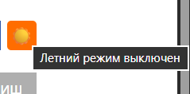
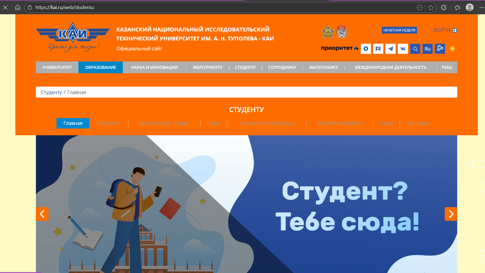
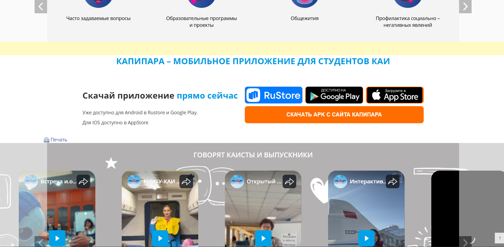
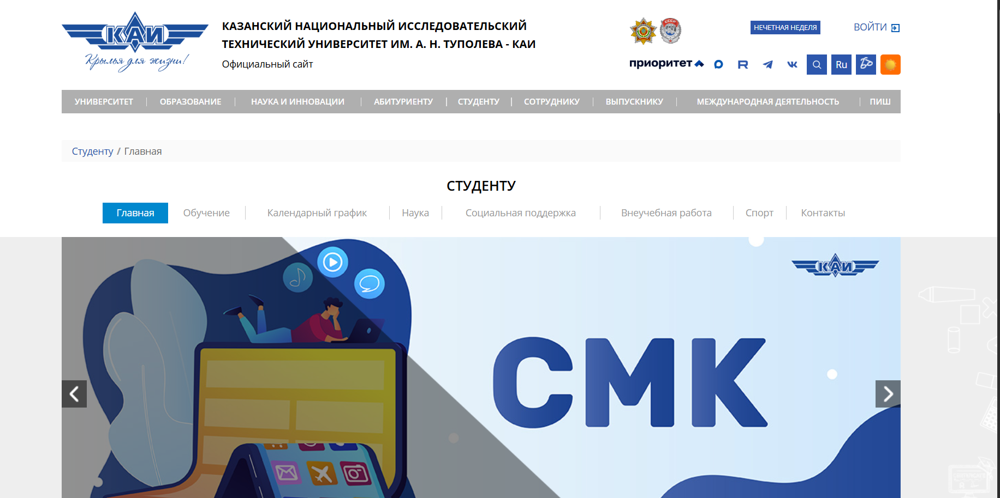
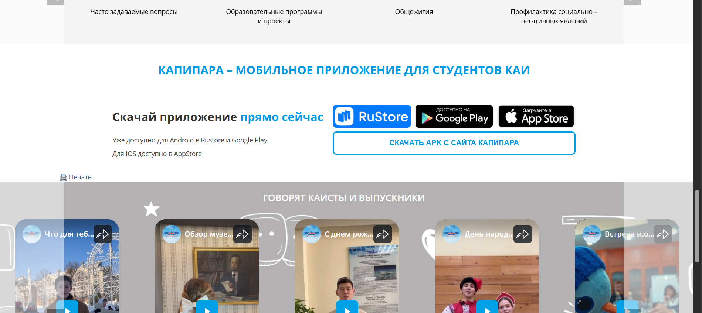

# KAI Summer Theme — Chrome/Yandex Browser Extension

Расширение автоматически добавляет кнопку на сайт **kai.ru**, позволяя включать и отключать «летнюю» тему оформления.

---

## Возможности
- Кнопка на всех страницах kai.ru
- Переключение светлой и летней темы
- Сохранение состояния (после перезагрузки тема остаётся включённой/выключенной)
- Работа:
  - на главной странице
  - на странице УНИВЕРСИТЕТ
  - на странице ОБРАЗОВАНИЕ
- Меняется 8+ параметров стиля:
  - цвет фона
  - цвет текста
  - цвет кнопок
  - фон блока новостей
  - фон слайдера
  - границы input
  - поведение кнопок при наведении
  - цвет шапки и подвала

---

## 📦 Установка

1. Скачайте папку проекта.
2. Откройте браузер → Расширение
3. Включите **Режим разработчика**
4. Нажмите **Загрузить распакованное**
5. Выберите папку проекта

Расширение сразу начнёт работать.

---

## Примеры

### Кнопка переключения

### Летний режим включён

### Летний режим выключен

---

